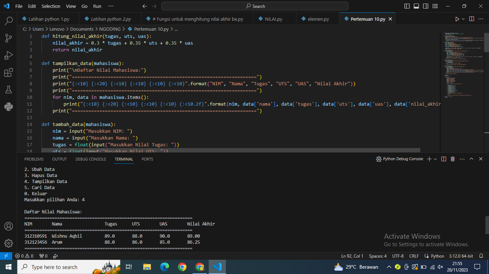
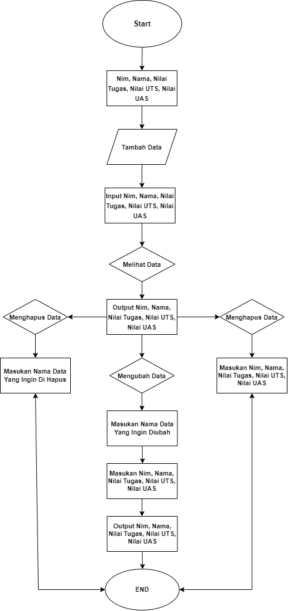
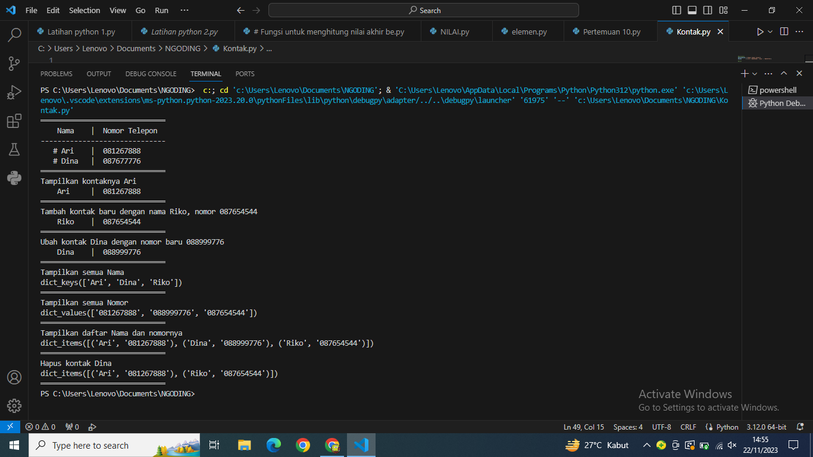

# README.md2
*PENILAIAN NILAI TUGAS,UTS, DAN UAS*

-Pengguna diminta untuk memasukkan informasi mahasiswa seperti nama, nim, nilai tugas, UTS, dan UAS.

-Program menghitung nilai akhir berdasarkan bobot yang diberikan.

-Data mahasiswa baru ditambahkan ke dalam sistem.

-Pengguna diminta untuk memasukkan NIM mahasiswa yang ingin diubah.

-Program menampilkan data mahasiswa tersebut dan memungkinkan pengguna mengubah informasi seperti nilai tugas, UTS, atau UAS.

-Setelah perubahan, nilai akhir dihitung ulang.

-Pengguna diminta untuk memasukkan NIM mahasiswa yang ingin dihapus.

-Data mahasiswa dengan NIM tersebut dihapus dari sistem.

-Program menampilkan seluruh data mahasiswa beserta nilai akhirnya.

-Pengguna diminta untuk memasukkan NIM atau nama mahasiswa yang ingin dicari.

-Program menampilkan data mahasiswa yang sesuai dengan kriteria pencarian.

-Program keluar dan menutup aplikasi.

-----------------------------------------------------------------------------------------------------
*• Buat Dictionary daftar kontak*

• Nama sebagai key, dan nomor sebagai value

• Tampilkan kontaknya Ari

• Tambah kontak baru dengan nama Riko, nomor 087654544

• Ubah kontak Dina dengan nomor baru 088999776

• Tampilkan semua Nama

• Tampilkan semua Nomor

• Tampilkan daftar Nama dan nomornya

• Hapus kontak Dina.

